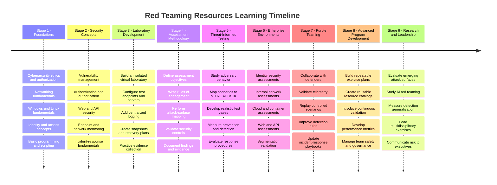

```mermaid
mindmap
  root((Red Teaming<br/>Resources))
    Governance and Ethics
      Written authorization
      Rules of engagement
      Scope definition
        In-scope systems
        Out-of-scope systems
        Testing window
        Permitted techniques
      Legal review
      Privacy protection
      Safety constraints
      Stop conditions
      Emergency contacts
      Evidence retention
      Cleanup requirements

    Team Structure
      Red Team
        Adversary simulation
        Exposure validation
        Objective testing
      Blue Team
        Monitoring
        Detection
        Investigation
        Response
      Purple Team
        Collaborative validation
        Detection engineering
        Control improvement
      White Team
        Exercise supervision
        Conflict resolution
        Safety management
      Executive Stakeholders
        Business objectives
        Risk acceptance
        Remediation ownership

    Knowledge Frameworks
      MITRE ATT&CK
        Enterprise
        Cloud
        Mobile
        ICS
      Cyber Kill Chain
      Unified Kill Chain
      OWASP
        Web Security
        API Security
        Mobile Security
      NIST Guidance
      Threat Intelligence
        Adversary reports
        Tactics and techniques
        Indicators
        Campaign analysis
      Vendor documentation
      Security research
      Defensive advisories

    Engagement Types
      External Assessment
        Internet-facing systems
        Web applications
        Remote access
        Cloud exposure
      Internal Assessment
        Active Directory
        Network segmentation
        Identity controls
        Internal applications
      Cloud Assessment
        Identity and access
        Storage exposure
        Workload security
        Logging coverage
      Application Assessment
        Web
        API
        Mobile
        Desktop
      Wireless Assessment
        Wi-Fi controls
        Segmentation
        Rogue-device detection
      Social Engineering
        Approved simulations
        Awareness validation
        Reporting behavior
      Physical Assessment
        Facility controls
        Badge procedures
        Visitor management
      Tabletop Exercise
        Scenario discussion
        Decision testing
        Crisis communication
      AI Red Teaming
        Prompt safety
        Data leakage
        Model misuse
        Robustness testing

    Reconnaissance Resources
      Passive Discovery
        Public records
        Search engines
        Certificate transparency
        Public code repositories
        Organization documentation
      Asset Discovery
        Domains
        Subdomains
        IP ranges
        Cloud resources
        Exposed services
      Technology Profiling
        Operating systems
        Web technologies
        Cloud platforms
        Identity providers
      Organization Profiling
        Business units
        Geographic locations
        Public contacts
      Threat Modeling
        Critical assets
        Trust boundaries
        Likely attack paths

    Assessment Resource Categories
      Network
        Asset inventory
        Service validation
        Segmentation testing
        Protocol analysis
      Identity
        Authentication review
        Authorization review
        Privilege analysis
        Trust relationships
      Web and API
        Attack-surface mapping
        Input validation
        Session management
        Access control
      Endpoint
        Configuration review
        Application controls
        Logging validation
        Detection coverage
      Cloud
        Identity policies
        Storage controls
        Network policies
        Audit logging
      Containers
        Image security
        Runtime controls
        Secret management
        Orchestration security
      Wireless
        Access-point inventory
        Encryption configuration
        Client isolation
      Physical
        Access procedures
        Security equipment
        Personnel response

    Operational Infrastructure
      Team Workstations
        Hardened operating system
        Disk encryption
        Access control
        Central logging
      Collaboration
        Secure communication
        Task management
        Evidence coordination
      Data Storage
        Encrypted repository
        Access restrictions
        Retention schedule
      Redirectors
        Authorized infrastructure
        Logging
        Access restrictions
      Laboratory
        Isolated virtual machines
        Snapshot management
        Simulated enterprise
        Logging and telemetry
      Safety
        Network isolation
        Rate limits
        Allow lists
        Automatic shutdown

    Exercise Lifecycle
      Preparation
        Define objectives
        Obtain authorization
        Model threats
        Select scenarios
      Discovery
        Identify assets
        Map exposure
        Validate assumptions
      Controlled Execution
        Test selected paths
        Record evidence
        Observe detections
      Objective Validation
        Confirm business impact
        Avoid unnecessary access
        Preserve evidence
      Cleanup
        Remove test artifacts
        Revoke temporary access
        Restore configurations
      Reporting
        Describe attack path
        Explain impact
        Recommend remediation
      Retesting
        Validate corrections
        Measure improvement

    Defensive Validation
      Telemetry
        Endpoint logs
        Network logs
        Identity logs
        Cloud audit logs
      Detection Engineering
        SIEM rules
        EDR analytics
        Network detections
        Behavioral analytics
      Incident Response
        Alert triage
        Investigation
        Containment
        Recovery
      Purple Teaming
        Replay authorized scenarios
        Measure visibility
        Tune detections
        Update playbooks

    Reporting Resources
      Executive Report
        Business risk
        Strategic findings
        Priority actions
      Technical Report
        Evidence
        Attack paths
        Affected assets
        Remediation guidance
      Detection Report
        Observed alerts
        Missing telemetry
        Detection gaps
      Timeline
        Test activity
        Defender response
        Decision points
      Metrics
        Detection rate
        Mean time to detect
        Mean time to respond
        Attack-path coverage
        Remediation rate

    Training Resources
      Foundations
        Networking
        Operating systems
        Programming
        Security principles
      Practice Platforms
        Cyber ranges
        CTF environments
        Intentionally vulnerable labs
        Local virtual networks
      Certifications
        Entry level
        Practitioner
        Advanced operator
        Team leadership
      Community Resources
        Awesome lists
        Conferences
        Research blogs
        Open-source projects
      Documentation Skills
        Note taking
        Evidence organization
        Technical writing
        Executive communication

    Resource Evaluation
      Legality
      Safety
      Maintenance status
      Documentation quality
      License
      Community activity
      Reproducibility
      Defensive relevance
      Laboratory compatibility
      Data privacy
```

# **`Awesome`** [Red](https://wikipedia.org/wiki/Red_team) [Teaming](https://github.com/cybersecurity-dev/awesome-red-teaming) Resources 

 

    
    &nbsp;
    
    &nbsp;
    
    

## 📖 Contents
- [Resources](#resources)
    - [Books](#-books)
    - [Videos](#-videos)
        - [Video Series](#video-series)
    - [Certifications](#-certifications)
- [My Other Awesome Lists](#my-other-awesome-lists)
- [Contributing](#contributing)
- [Contributors](#contributors)

## Resources

### [↑](#-contents) Books
* [Red Team Engineering: The Art of Building Offensive Tools and Infrastructure](https://www.amazon.com/Red-Team-Engineering-Offensive-Infrastructure/dp/1718504268)
* [RTFM: Red Team Field Manual v2](https://www.amazon.com/RTFM-Red-Team-Field-Manual/dp/1075091837)
* [Evasion Engineering: Building Custom Red Team Tools for Modern Defenses](https://www.amazon.com/Evasion-Engineering-Building-Custom-Defenses/dp/1718505043)

### [↑](#-contents) Videos
- [Ethical Hacking Course: Red Teaming For Beginners by q0phi80](https://youtu.be/OtcP8c4wZys?si=fHinY4O9qMGbE-zH)
#### Video Series
- [Red Team Essentials by HackerSploit](https://youtube.com/playlist?list=PLBf0hzazHTGMjSlPmJ73Cydh9vCqxukCu&si=VDOU6ZdhNl5L9n2o)
- [Hacking Active Directory by Hacker Blueprint](https://youtube.com/playlist?list=PLM1644RoigJuTWKG4ZUgAFkiY3WBMqoyQ&si=on251dL-fdVlaNQS)

### [↑](#-contents) Certifications
- [GIAC Red Team Professional (`GRTP`)](https://www.giac.org/certifications/red-team-professional-grtp)
- [OSAI by OffSec](https://help.offsec.com/hc/articles/46593096734612-OSAI-Exam-Guide)
- [OSAI+ by OffSec](https://help.offsec.com/hc/articles/46593095198740-OSAI-Advanced-AI-Red-Teaming-AI-300-FAQ)
    - [Advanced AI Red Teaming by OffSec](https://www.offsec.com/courses/ai-300/)
- [OSCP+ by OffSec](https://help.offsec.com/hc//articles/4412170923924-OSCP-Exam-FAQ)
    - [Penetration Testing with Kali Linux by OffSec](https://www.offsec.com/courses/pen-200/)

### [↑](#-contents) AI-powered Assistant Tools
 - [Decepticon](https://github.com/PurpleAILAB/Decepticon) - Autonomous Hacking Agent for Red Team.
 - [Darkmoon](https://github.com/ASCIT31/Dark-Moon) - Open source (GPL-3.0) autonomous AI penetration testing platform where an LLM orchestrates specialist agents and offensive tools over MCP and proves each finding with a real exploit.
 - [DeepTeam](https://github.com/confident-ai/deepteam) - [DeepTeam](https://trydeepteam.com/) is a framework to red team LLMs and AI agents.
 
##

### My Other Awesome Lists
You can access the my other awesome lists [here](https://cyberthreatdefence.com/my_awesome_lists)

### Contributing
[Contributions of any kind welcome, just follow the guidelines](contributing.md)!

### Contributors
[Thanks goes to these contributors](https://github.com/cybersecurity-dev/awesome-red-teaming-resources/graphs/contributors)!

### License

[🔼 Back to top](#awesome-red-teaming-resources-)
